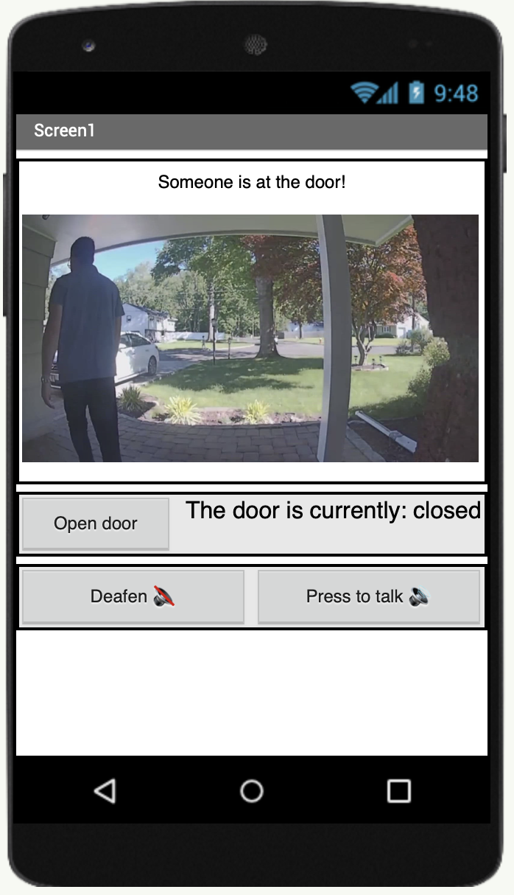

## Samrt Door Bell raspberry pi python project link:
https://github.com/coryTuyaoqing/SmartDoorBell_Pi

# How to clone this project?
* Android studio -> file -> new -> project from version control
* copy and paste the URL link of this repository
* select the file path that you want to store the project
* click clone

## functions of the android app

1. receive video stream from raspberry pi

2. transmit audio data bi-direction

3. visualize data from raspberry pi

4. read voice message from the data base

## function of data base

1. store information of different family members
2. store voice information from the visitor

### my tasks

* set up a GitHub code repository
* do research on how to design Android app UI 
* design UI appearance and functions
* write Android app UI code
* test the function

### daily/weekly meeting?

### GUI Preview

